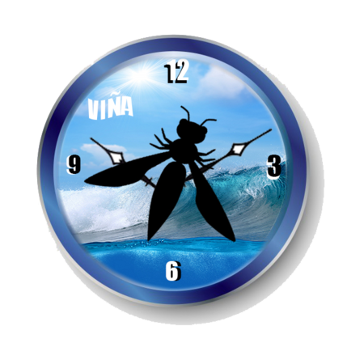

---

layout: col-sidebar
title: OWASP Vina Del Mar
tags: example-tag
level: 0

region: South America

auto-migrated: 0
meetup-group: OWASP-Vina-del-Mar-Chapter
country: Chile
postal-code: 

---

## Welcome

OWASP Foundation (Overview Slides) is a professional association of global members and is open to anyone interested in learning more about software security. Local chapters are run independently and guided by the Chapter_Leader_Handbook. As a 501(c)(3) non-profit professional association your support and sponsorship of any meeting venue and/or refreshments is tax-deductible. Financial contributions should only be made online using the authorized online chapter donation button. To be a SPEAKER at ANY OWASP Chapter in the world simply review the speaker agreement and then contact the local chapter leader with details of what OWASP PROJECT, independent research or related software security topic you would like to present on.

## Participation
The Open Web Application Security Project (OWASP) is a nonprofit foundation that works to improve the security of software. All of our projects ,tools, documents, forums, and chapters are free and open to anyone interested in improving application security. 

Chapters are led by local leaders in accordance with the [Chapter Policy](https://owasp.org/www-policy/). Financial contributions should only be made online using the authorized online donation button. To be a SPEAKER at ANY OWASP Chapter in the world simply review the [speaker agreement](https://owasp.org/www-policy/legal/speaker-agreement) and then contact the local chapter leader with details of what OWASP Project, independent research, or related software security topic you would like to present.

Everyone is welcome and encouraged to participate in our [Projects](/projects), [Local Chapters](/chapters), [Events](/events), [Online Groups](https://groups.google.com/a/owasp.com/){:target='_blank'}, and [Community Slack Channel](https://owasp.slack.com/){:target='_blank'}. We especially encourage diversity in all our initiatives. OWASP is a fantastic place to learn about application security, to network, and even to build your reputation as an expert. We also encourage you to be [become a member](/membership) or consider a [donation](/donate) to support our ongoing work.

## Local News
- Meeting Valparaiso/Viña del mar y el resto de chile (no santiago) 
- Everyone is welcome to join us at our chapter meetings.

Owasp Viña del Mar was born in April 2019 in response to the need for evolution and technological development in the Valparaíso region, which includes one of the most important urban areas in the country: the Viña del Mar conurbation. In addition to this, it has two important shipping ports for various types of Chilean export products: Valparaíso and San Antonio. And as if that were not enough in the city of Valparaíso is the seat of the Legislative Power: the National Congress.

Our commitment is to contribute is to share knowledge and contribute to the development of the region, promoting the use of OWASP with the proposal of identifying secure software, thus creating new spaces for integration between the student, corporate and government community that will succeed in growth and growth. knowledge development.

