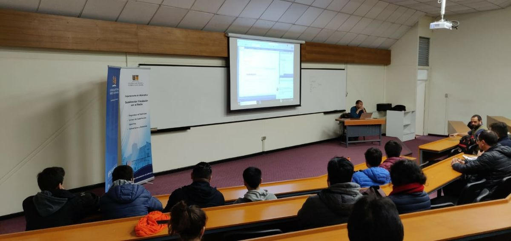
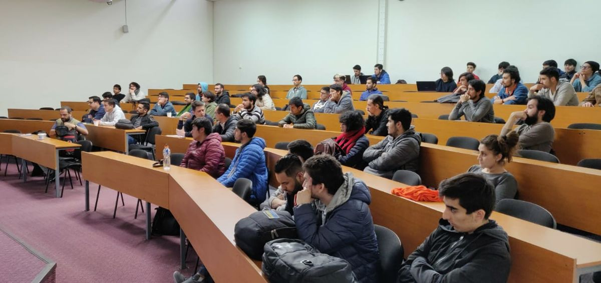
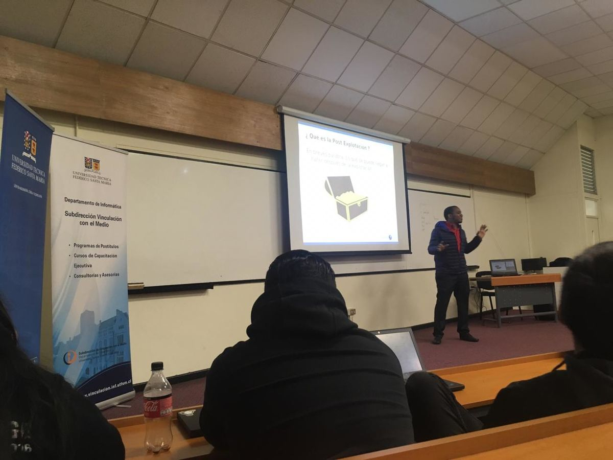
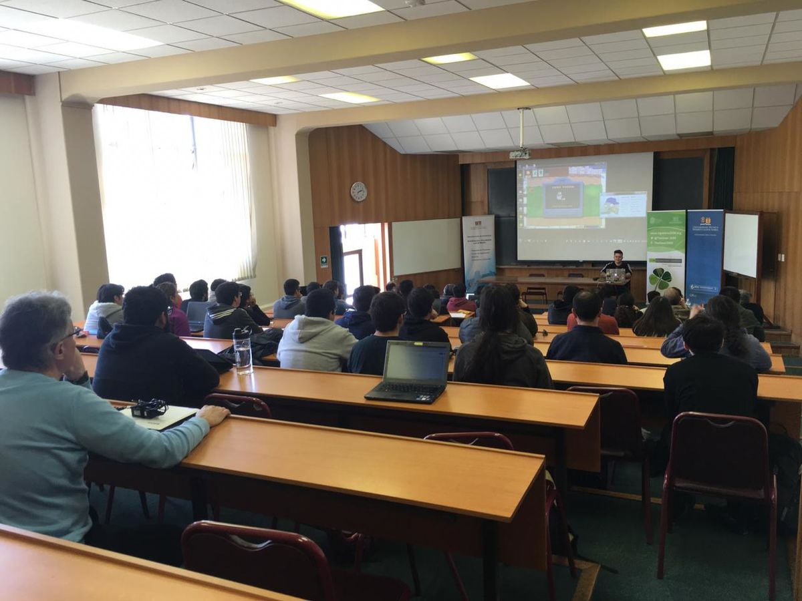
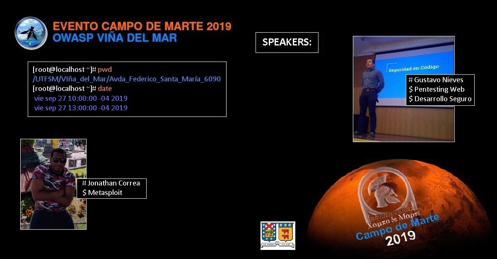
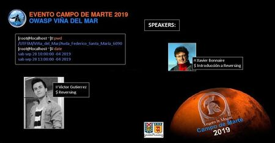
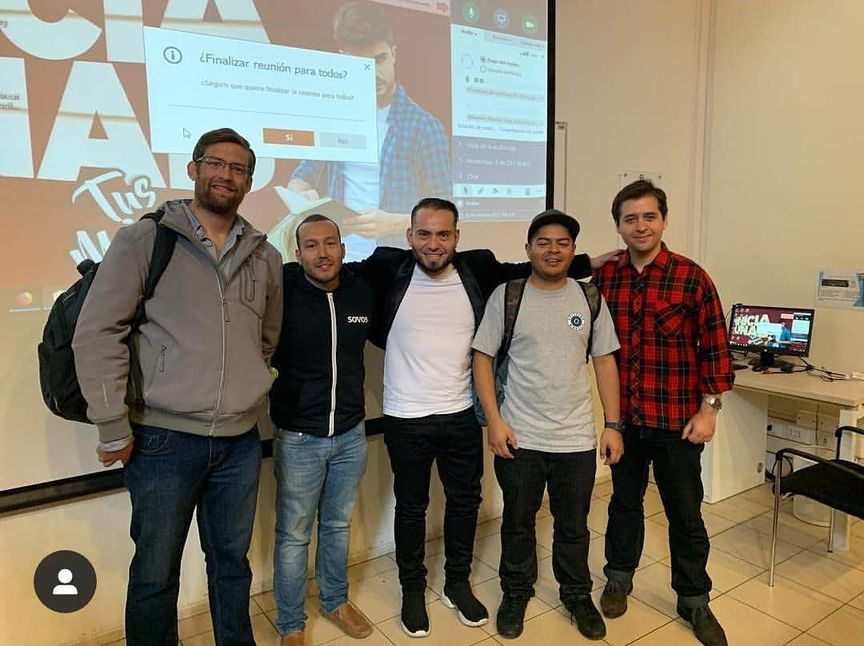

## **EVENTOS PASADOS**  

### ***Owasp Viña del Mar-Meeting***

22 of July to 2021
We are part of the CFP and Marketing comitte

Link if the event : <https://www.meetup.com/es/OWASP-Vina-del-Mar-Chapter/events/279182584/> 
Video:<https://youtu.be/yLvTiavxIZk> 

Talks: 

1)Huella Digital-Magdiel Guitierrez/Consultor de Securidad (1-30 minutos)

2)MAP(Patrones para desarrollar Microservicios seguros en Cloud) Cloud Security Alliance-Gustavo Nieves(30-59)/Owasp Chapter Leader/Author Cloud Security Alliance/IEEE Published Author

### ***Owasp Latam Home 2021***

3 to 5 of august to 2021
We are part of the CFP and Marketing comitte

Link if the event : <https://owasp.org/www-event-2021-latam-at-home/index-en> 
Videos:<https://youtu.be/wYhqYyFsrrE> 

### ***Desarrollo seguro con Owasp -- Parte 1 y desarrollo seguro con Owasp --Parte 2***

Aprende a mitigar las vulnerabilidades de seguridad en el código fuente y a programar sin fallas de seguridad en tu aplicación.

OWASP (acrónimo de Open Web Application Security Project, en inglés 'Proyecto abierto de seguridad de aplicaciones web') es un proyecto de código abierto dedicado a determinar y combatir las causas que hacen que el software sea inseguro. La Fundación OWASP es un organismo sin ánimo de lucro que apoya y gestiona los proyectos e infraestructura de OWASP (wikipedia: https://es.wikipedia.org/wiki/Open_Web_Application_Security_Project)

OWASP Viña del Mar nos trae un taller de 2 partes, 2 horas cada uno para aprender sobre desarrollo seguro para detectar, remediar e implementar estándares herramientas de desarrollo seguro en tu código fuente

https://www.meetup.com/es-ES/Women-Who-Code-Santiago/events/272773158/?isFirstPublish=true

### *** Owasp Chapter ALL DAY***

Link if the event : <https://owasp.org/www-community/social/chapters_all_day/> 

Speakers
|Patricia Valdivia 
|Paola Perez
|Gustavo Nieves.

                   
Youtube Channel edit video : <https://www.youtube.com/watch?v=VUUPnMhNQAw>
 
         

### ***Owasp LATAM Stay Home 2020***

Link if the event : <https://owasp.org/www-event-2020-latam-at-home/>

                   Chapter Speakers : Mikel Rufian
                   Paola Perez
                   Milagroz Cruz
                   German Schmidt
                   Victor Guitierrez
                   Gustavo Nieves
                
Youtube Channel  video  <https://www.youtube.com/feed/my_videos>

### ***Desarrollo Seguro Marzo 2020***

Taller de desarrollo seguro Owasp Vina primera edición online (16 horas)

Se entregarán certificado de completacion de curso firmado por Owasp International desde el board en USA

Curso patentado en el departamento derechos intelectuales de Chile.
Rut: 76.561.829-0
Appsec SPA.

Consultas hacerlas por correo electronico gustavo.nieves@owasp.org

<https://docs.google.com/forms/u/1/d/e/1FAIpQLSdVW3UT6oPGvhanALP_LrL0jBU_VTAgeY73HBJGwn_QgJ7ZkA/viewform>

### ***Entrenamientos Campos de Martes y Owasp Viña del Mar-2019***

Speakers
|Javier Bonaire
|Gustavo Nieves 
|Jonathan Correa
|Victor Gutierrez

Ya nos encontramos trabajando para traer a este espacio a expertos
reconocidos que marcaran la diferencia compartiendo con todos los
interesados en diferentes temas de seguridad, pronto le estaremos
anunciando detalles de este evento.

27 y 28 de septiembre Entrenamientos a Campos de Marte con Owasp y
Dreamlab

Av. España 1680, Valparaíso, Auditorio

<https://www.eventbrite.com/e/taller-de-entrenamiento-owasp-vinacampos-de-martes-tickets-71523563905>

### OWASP LATAM TOUR 2019

Este año Viña del Mar se sumó al OWASP Latam Tour 2019, y fue toda una
experiencia llena de entusiasmo y desafíos constantes que logramos
superar con éxito, nada de esto hubiese sido posible sin el apoyo de La
Universidad Andrés Bello, al Senador Kenneth Pugh, a todos nuestros
expositores quienes dieron lo mejor de si en cada una de sus charlas, y
en especial a los asistentes, a todos ustedes queremos decirle Muchas
Gracias por su apoyo, esperamos seguir creciendo en comunidad y contar
con ustedes en los próximos eventos.

El evento se llevo a cabo el 24 de mayo, teniendo dos sedes en
simultáneo:

  - INACAP Sede Valparaiso, Auditorio Principal, Av. España 2255,
    Valparaiso
  - Centros de Transmisión Simultanea UNAB, Piso 1, Auditorio 5,
    Santiago

#### AGENDA DE CHARLAS

<table>
<tbody>
<tr class="odd">
<td>
<strong>Fecha</strong>
</td>
<td>
<strong>Expositor</strong>
</td>
<td>
<strong>Título</strong>
</td>
<td>
<strong>Descripción</strong>
</td>
</tr>
<tr class="even">
<td>
24 de mayo 10:00 a 10:45 Hrs
</td>
<td>
<strong>Philippe Delteil</strong> - Chile Profesor en Universidad Abierta de Recoleta.<strong><a href="https://www.linkedin.com/in/philippe-delteil/">Linkedin</a></strong>

<strong>Expositor de taller técnico en la DEFCON China 2019.</strong>
</td>
<td>
Historias macabras de un Hacker en salud pública chilena.
</td>
<td>
En el sector de salud pública con más de 14 millones de pacientes no tiene expertos en ciberseguridad cómo me fue posible obtener más de 3 millones de archivos de pacientes.
</td>
</tr>
<tr class="odd">
<td>
24 de mayo 11:00 a 11:45 Hrs
</td>
<td>
<strong>Freddy Macho Nuñez</strong> - Venezuela Ingeniero en Informática<strong>. <a href="https://www.linkedin.com/in/freddymacho/">Linkedin</a></strong>

<strong>Certificaciones: JSSP, JSSN, JSSAD, LAM 27001, LAM 22301, Lead Cybersecurity Manager ISO 27032, ITIL v3.</strong>
</td>
<td>
Rompiendo el Portal SAP Vulnerabilidades que amenazan la seguridad de nuestros datos.
</td>
<td><ul>
<li>Casos Fraude con SAP: Transacciones falsas Modificación de datos maestros.</li>
<li>Sabotaje: Negación de servicio Modificación de informes financieros. Acceso a la red tecnológica (SCADA) por relaciones de confianza.</li>
<li>Espionaje Robo de información financiera Robo de secretos corporativos. Robo de listas de proveedores y clientes Robo de datos de recursos humanos</li>
</ul></td>
</tr>
<tr class="even">
<td>
24 de mayo 12:00 a 12:45 Hrs
</td>
<td>
<strong><em>Invitado Especial:</em></strong> <strong>Kenneth Pugh Olavarría</strong> - Chile

Senador por la 6ª Circunscripción, Región de Valparaíso.  Integrante de las comisiones permanentes de Defensa Nacional e Intereses Marítimos, Pesca y Acuicultura
</td>
<td>
Desafíos Legislativos Chilenos en Ciberseguridad
</td>
<td>
Análisis critico de situación legislativa nacional y propuestas para abordar desafío.
</td>
</tr>
<tr class="odd">
<td>
24 de mayo 14:30 a 15:15 Hrs
</td>
<td>
<strong>Gabrielle Botbol</strong> - Francia <strong><a href="https://www.linkedin.com/in/gabrielle-botbol-1bba1177/">Linkedin</a></strong> <strong>Cybersecurity blogger / Junior pentester / Leader of #WoSEC Paris chapter / Co-founder LRCCN</strong>
</td>
<td>
Learn how training- En ingles Webinar
</td>
<td>
How to set up a free self training in infosec with online resources (and other things).
</td>
</tr>
<tr class="even">
<td>
24 de mayo 15:30 a 16:15 Hrs
</td>
<td>
<strong>Alberto Daniel Hill</strong> - Uruguay Ingeniero en Informática<strong>.<a href="https://www.linkedin.com/in/nofear75/">Linkedin</a></strong>

<strong>Hacker, Writer, Bitcoin, Blockchain consultant. Information Security Expert @Encrybit. Chief Security Officer @EraSwap.</strong>
</td>
<td>
Nuevo deporte riesgoso: Hackeo de Criptomonedas.-Charla Webinar
</td>
<td>
Explicando nuevo objetivo que más apetito causa en el cibercrimen.¿ La explosión de ataques exitosos para robar criptomonedas, fortunas obtenidas pero…. Unos cuantos a prison!
</td>
</tr>
<tr class="odd">
<td>
24 de mayo 16:30 a 17:15 Hrs
</td>
<td>
<strong>Mikel Rufián Albarrán</strong> - España. <strong><a href="https://www.linkedin.com/in/mikelrufian/">Linkedin</a></strong> Managing Director – Head of Global Cyber Security &amp; Intelligence Lead. Detective y Director de Seguridad del Ministerio del Interior Español. <strong>Especializado en Esports, Ciberseguridad, Ciberinteligencia, Cibercriminología, Seguridad Inteligencia, Criminología.</strong>
</td>
<td>
Ciberinteligencia Hiperconvergente: Nuevos retos IT/OT
</td>
<td>
Con la globalización, la digitalización y la conectividad organizaciones de todo tipo de sectores se enfrentan al reto de identificar y aprovechar las oportunidades que ofrece el salto al mundo digital. El auge de la hiperconvergencia representa la combinación de componentes virtuales y físicos, entre los sistemas de información (IT) y redes de operaciones (OT) que interconectan los distintos elementos de producción y los sistemas de información corporativos (IT) la industria plantea nuevos retos de dependencia tecnológica para el desarrollo normal de las actividades de las organizaciones, lo que ha abierto una ventana hacia ciberriesgos y ciberamenazas hasta ahora desconocida. Es un pilar fundamental aplicar las medidas de Ciberinteligencia.
</td>
</tr>
<tr class="even">
<td>
 24 de mayo de 2020
</td>
<td>
<strong><a href="https://www.linkedin.com/in/danieliturrietagodoy/">Daniel Iturrieta</a></strong> – Chile Jefe de proyectos de Seguridad Senior en Redbanc
</td>
<td>
La unidad hace la fuerza, la importancia de colaborar en tiempos de ciberamenaza
</td>
<td>
En pleno auge de las cibertecnologias, plataformas cloud, planes de concientización, planes de continuidad operacional, etc, es de vital importancia entender que la unión hace la fuerza, este es el lema que se pretende imprimir en el ADN de las organizaciones y en los equipos de ciberseguridad hoy en día. La tendencia mundial es compartir en tiempo real la información de los ataques sufridos o descubiertos por las organizaciones, hoy ya existen tecnologías que permiten tanto a profesionales como organizaciones ser parte de esta visión de colaboración en pos de una internet más segura.
</td>
</tr>
</tbody>
</table>

### TALLERES

Estaremos realizando dos talleres prácticos de 6 horas cada uno donde
podrás aprender herramientas que te ayudarán a proteger aplicaciones
web.

#### UBICACIÓN

Pendiente por confirmar en nueva fecha.

#### INFORMACIÓN IMPORTANTE

Debido a la toma que se lleva a cabo en la UNAB por parte los
estudiantes, hemos sido notificados que los talleres dispuestos para el
día sábado 25 de mayo no podrán realizarse, les pedimos nuestras
disculpas y estar atentos a la nueva locación y fecha. Si ud. realizó el
pago y desea la devolución por favor déjenos saber a través del correo
electrónico: **gustavo.nievesarreaza@owasp.org**

#### AGENDA DE TALLERES

<table>
<tbody>
<tr class="odd">
<td>
<strong>Fecha/Duracion</strong>
</td>
<td>
<strong>Instructor</strong>
</td>
<td>
<strong>Título</strong>
</td>
<td>
<strong>Descripción</strong>
</td>
</tr>
<tr class="even">
<td>
Por Informar
</td>
<td>
Gustavo Nieves Arreaza <a href="https://www.linkedin.com/in/gustavo-nieves-arreaza/"><strong>Linkedin</strong></a> <strong>Conferencias en la IEEE</strong>
</td>
<td>
Taller:Desarrollo Seguro para Programadores con Owasp Esapi (Libreria de codigo utilizado para enseñar a como mitigar vulnerabilidades)
</td>
<td><ul>
<li>Que es un Vector de Ataque</li>
<li>Como hacer una auditoria Web y de Web Services.</li>
<li>Descargar y Implementar las librerías Esapi en el IDE de Desarrollo</li>
<li>Inventario de las Funciones del Owasp Esapi</li>
<li>Usar las funciones de las librerías Esapi para mitigar vulnerabilidades del Owasp top Ten</li>
</ul></td>
</tr>
<tr class="odd">
<td>
<strong>Fecha/Duracion</strong>
</td>
<td>
<strong>Instructor</strong>
</td>
<td>
<strong>Título</strong>
</td>
<td>
<strong>Descripción</strong>
</td>
</tr>
<tr class="even">
<td>
Por Informar
</td>
<td>
Bertin Bervis <a href="https://www.linkedin.com/in/bertin-b-9a8735126/"><strong>Linkedin</strong></a> <strong>Conferencista en la Defcon</strong>
</td>
<td>
Taller:Seguridad Informática Industrial
</td>
<td><ul>
<li>Introducción a la Cyber Seguridad industrial</li>
<li>Historia y análisis de incidentes previos registrados</li>
<li>Equipo industrial (PLCs,HMIs,equipo de red)</li>
<li>Protocolos industriales</li>
<li>Conceptos , recomendaciones de configuración de la red industrial</li>
<li>Reconocimiento y detección de equipo industrial en la red</li>
<li>Vulnerabilidades de equipos industriales en aplicaciones web Caso de estudio practico RCE, XSS Persistente .</li>
</ul></td>
</tr>
</tbody>
</table>

#### REGISTRO

Inscripción de talleres:
h[ttps://www.eventbrite.com/e/taller-de-desarrollo-seguro-con-owasp-esapi-tickets-60936976136](https://www.eventbrite.com/e/taller-de-desarrollo-seguro-con-owasp-esapi-tickets-60936976136)

Los talleres tienen un valor de:

  - Profesionales: $ 80.000 clp
  - Estudiantes: $ 60.000 clp

Para pagos escribir al siguiente
correo **gustavo.nievesarreaza@owasp.org** en el detalle del pago
colocar Owasp Viña del Mar taller: (Indique nombre del taller:
Desarrollo Seguro o Seguridad Industrial).

### SEGURIDAD EN CÓDIGO LIBRE

Con el objetivo de potenciar las áreas de Seguridad informática de  las
empresas,persuadir a los estudiantes a incursionar en el área de
seguridad informática, el pasado 11 y 12 de abrill del 2019, se llevo en
colaboración con **ISACA** y la **Universidad Andrés Bello - UNAB** el
evento Seguridad en Código Libre donde se convocó a más de 150
asistentes del área de TI, especialmente del área de seguridad
informática como estudiantes de informática, los cuales mostraron su
entusiasmo ante las charlas de exponentes que nos acompañaron desde
Argentina, Venezuela,Canadá,Costa Rica y Chile.

El evento se realizó en dos sedes en simultaneo:

  - Universidad Andrés Bello - UNAB, Antonio varas 807, subterraneo,
    Providencia

#### AGENDA DE CHARLAS

<table>
<tbody>
<tr class="odd">
<td>
<strong>Fecha</strong>
</td>
<td>
<strong>Expositor</strong>
</td>
<td>
<strong>Título</strong>
</td>
<td>
<strong>Descripción</strong>
</td>
</tr>
<tr class="even">
<td>
Jueves 11 de abril de 2019
</td>
<td>
<strong><a href="https://www.linkedin.com/in/aiacobellisec/">Alejandro Iacobelli</a></strong> – Argentina Application Security Manager at Mercado Libre

<strong><a href="https://www.linkedin.com/in/rodrigo-fernandez-apas-240a26142/">Rodrigo Apas</a></strong> – Argentina Application Security Engineer at Mercado Libre
</td>
<td>
Usando la mentalidad para cambiar el curso de la empresa. Implementando el Red Teaming
</td>
<td>
El enfoque que proponemos es al revés y creemos que la formación de Red Teaming es una buena manera de lograr este objetivo. Compartir la experiencia obtenida formando Red Teaming, como influye en la cultura de los equipos de desarrolladores y cómo manejamos el pentesting externo entre otras cosas.
</td>
</tr>
<tr class="odd">
<td>
Jueves 11 de abril de 2019
</td>
<td>
<strong><a href="https://www.linkedin.com/in/rtorresve/">Rafael Torres</a></strong> – Venezuela Experiencia en web scrappingpara probar las OWASP Top 10
</td>
<td>
Usando Web scrapping para probar las OWASP Top 10
</td>
<td>
Demostración del uso de un set de herramientas para realizar algunos test de seguridad sobre aplicaciones web (Docker, Selenium, Python)
</td>
</tr>
<tr class="even">
<td>
Jueves 11 de abril de 2019
</td>
<td>
<strong><a href="https://www.linkedin.com/in/gustavo-nieves-arreaza/">Gustavo Nieves</a></strong> – Venezuela/Chile Presidente capítulo de Owasp Viña del Mar
</td>
<td>
Auditar un sitio web sin ser detectado (usando sitios web y plugins)
</td>
<td>
Actualmente la mayoría de las compañías filtran la peticiones de los proxys como Burp,Owasp Zap y Accunetix, pero qué pasa si haces una auditoría solo haciendo consultas en sitios web y utilizando plugins gratuitos  de los  navegadores, demostraremos que las mayores fallas de una aplicación son como son configuradas, por eso llegaremos a mostrar lo importante que es desarrollar el modelo de amenazas, con tu ayuda, contra vectores de ataque conocidos.
</td>
</tr>
<tr class="odd">
<td>
Jueves 11 de abril de 2019
</td>
<td>
<strong><a href="https://www.linkedin.com/in/tanya-janca-60ab0998/">Tanya Janca</a> - Canada</strong>Senior cloud advocate for Microsoft, specializing in application security
</td>
<td>
Pushing Left Like a Boss
</td>
<td>
With incident response and penetration testing currently receiving most of our application security dollars, it would appear that industry has decided to treat the symptom instead of the disease. “Pushing left” refers to starting security earlier in the SDLC; addressing the problem throughout the process. From scanning your code with a vulnerability scanner to red team exercises, developer education programs and bug bounties, this talk will show you how to ‘push left', like a boss.
</td>
</tr>
<tr class="even">
<td>
Jueves 11 de abril de 2019
</td>
<td>
<strong><a href="https://www.linkedin.com/in/danieliturrietagodoy/">Daniel Iturrieta</a></strong> – Chile Jefe de proyectos de Seguridad Senior en Redbanc
</td>
<td>
La unidad hace la fuerza, la importancia de colaborar en tiempos de ciberamenaza
</td>
<td>
En pleno auge de las cibertecnologias, plataformas cloud, planes de concientización, planes de continuidad operacional, etc, es de vital importancia entender que la unión hace la fuerza, este es el lema que se pretende imprimir en el ADN de las organizaciones y en los equipos de ciberseguridad hoy en día. La tendencia mundial es compartir en tiempo real la información de los ataques sufridos o descubiertos por las organizaciones, hoy ya existen tecnologías que permiten tanto a profesionales como organizaciones ser parte de esta visión de colaboración en pos de una internet más segura.
</td>
</tr>
<tr class="odd">
<td>
Viernes 12 de abril de 2019
</td>
<td>
<strong><a href="https://www.linkedin.com/in/nahumdeavila/">Nahum Deavila</a></strong> - Colombia Instructor de Ethical hacking e investigador con enfoque al análisis de malware. Fundador del iSecurity Summit Colombia y el Chief Technology Officer de Netsat.
</td>
<td>
Resiliencia y Ciberseguridad: una convergencia necesaria
</td>
<td>
A diario las empresas sufren ciberataques que afectan directamente la integridad de la información y diferentes factores los cuales al final del día terminan por comprometer la continuidad de un negocio. Sin embargo, ser resilientes y estar preparados para levantarnos después de la tormenta es la principal necesidad que toda organización que ha sido comprometida por un atacante. Entender que sucedió, y como reaccionar es el rumbo que deberá tomar el grupo de personas encargadas de atender el incidente de seguridad.
</td>
</tr>
<tr class="even">
<td>
Viernes 12 de abril de 2019
</td>
<td>
<strong><a href="https://www.linkedin.com/in/bertin-b-9a8735126/">Bertin Bervis</a></strong> – Costa Rica Speaker en conferencias técnicas de seguridad informática por sus investigaciones en el campo ICS/OT.
</td>
<td>
javascript y protocolos industriales : mala combinación
</td>
<td>
caso de estudio practico sobre vulnerabilidades en aplicaciones web de equipos industriales que se pueden explotar gracias a la interacción de un protocolo industrial con propiedades específicas que convive e intercambia datos con la aplicación web del dispositivo industrial.
</td>
</tr>
<tr class="odd">
<td>
Viernes 12 de abril de 2019
</td>
<td>
<strong><a href="https://www.linkedin.com/in/rudypinochet/">Rudy Pinochet</a></strong> – Chile Director de membresías académicas ISACA, al duo en seguridad en código de Mercado Libre
</td>
<td>
Como testear Apache SSL y los más usados CMS (WordPress / Drupal / Joomla)
</td>
<td>
Como usando herramientas gratuitas que nos ayuden a mitigar y identificar cómo los riesgos de seguridad en CMS.
</td>
</tr>
</tbody>
</table>

# Chapter Sponsors

This chapter's yearly activity is being supported by the generous
sponsorship of the following companies:

[Category:Latin America](Category:Latin_America "wikilink")

